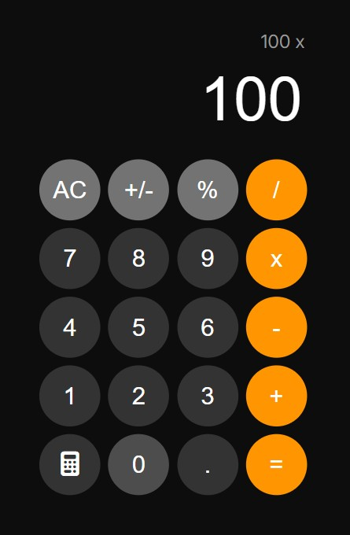

# iOS Calculator

## Project Summary

This is a fully functional, mobile-responsive calculator built with HTML, CSS, and vanilla JavaScript to replicate the interface and behavior of Apple’s iOS 18 Calculator. It provides a clean, intuitive user experience with dynamic input handling and responsive design.

The calculator supports basic operations (addition, subtraction, multiplication, division) along with special functions like clear (AC), percentage, and sign toggle (±). A dual-display system shows the full expression during input and the result after evaluation, mimicking iPhone Calculator logic.

The project emphasizes DOM manipulation, event handling, semantic HTML, and modern CSS practices—including variables, media queries, and grid layouts. It promotes maintainable, accessible code and serves as a strong foundation for expanding into advanced UI logic or React-based applications.

## Table of Contents

- [Mock Up](#mock-up)
- [Instructions](#instructions)
- [Key Features](#key-features)
- [Deployed Aplication](#deployed-application)

## Mock-Up

The following image shows the web application's appearance and functionality:

## Instructions

To use this application, follow these simple steps:

### 1. Open the Application

- Navigate to the project folder.

- Open `index.html` in your preferred browser.

### 2. Use the Calculator

- Use mouse clicks or touchscreen taps to interact with the buttons.

- Input mathematical expressions and press = to calculate results.

- Click "AC" to clear the current input or result.

### 3. Adjust Responsiveness

- Resize your browser or use device emulation tools to test responsiveness.

## Key Features

**iOS-style Interface:** Mimics Apple’s calculator design and behavior with high fidelity.

**Interactive UI Feedback:** Buttons visually respond to hover and active states for improved UX.

**Dual Display Logic:** Displays full expression during input, and separates result and operation after evaluation.

**Keyboard & Click Support:** Handles both button clicks and keyboard input (optional enhancement).

**Responsive Layout:** Scales fluidly from small mobile screens to ultra-wide displays using CSS Grid and media queries.

## Deployed Application

[iOS Calculator](https://gilmerperez.github.io/ios-calculator/)